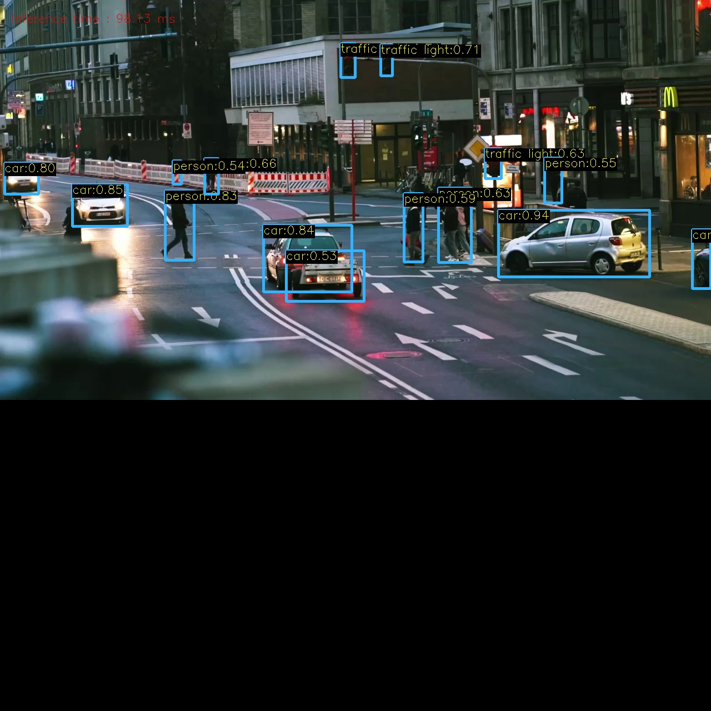
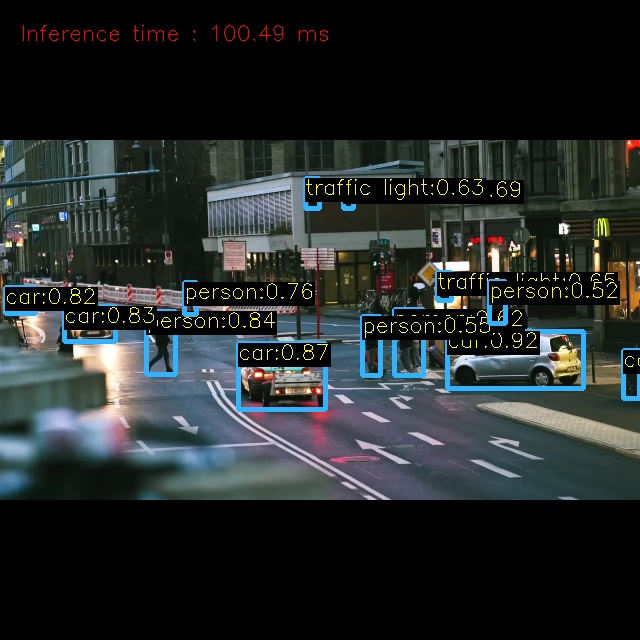

#  Letterboxing and its cuda acceleration 

## Introduction

This project builds upon my previous work, [YOLOv5 Inference in Python & C++](https://github.com/BCYounker/YOLOv5_inference_python_cpp). It explores advanced letterboxing techniques in C++ and details the implementation of CUDA programming to accelerate the letterboxing preprocessing. The CUDA-accelerated version of letterboxing achieves a significant speed improvement, **approximately 5x-6x faster** (CPU timing is around 3ms, while GPU with 1000 cores operates around 0.5ms), while maintaining the same object detection accuracy as the enhanced C++ letterboxing code without CUDA.


>While the previous project focused mainly on evaluating C++ and Python equivalence, this project aims to further explore the potential of C++ in conjunction with CUDA programming for preprocessing.


## Environment Preparation

The environment preparation is the same as the previous guidance provided in [YOLOv5 Inference in Python & C++](https://github.com/BCYounker/YOLOv5_inference_python_cpp). Please refer to that repository for detailed setup instructions.


## Table of contents[](#table-of-contents)

- [Execution](#execution)
- [Sample](#sample)

## Execution

#### C++ Linux

Within each subproject, like yolov5_x_xx

```
// delete original build folder first
mkdir build
cmake -S . -B build 
cmake --build build/
./build/main
```

## Sample

### original letterbox & improved letterbox
<p align="center">
  
  
</p>

>original letterbox is simply placing the original image in the top-left corner of a black square.

>improved letterbox use affine transformation for precise image scaling and positioning, and put it in the center. It has greater adaptability to various input size.

>Improved Result: Do not have duplicate detetion for the car, not detect median barrier as person

### cuda-programming
Main process (1) write CUDA function to perform affine warp transformation on images, use Thread/Block to accelerate, convert interleaved RGB picture to consecutive list on memory  (2) pass the memory between device and host


#### Some code screenshot
The code in main function (record time, prepare memory, call cuda process function) 


Uncompleted code about cuda process function. In that case, set threads=1000, you can change this based on your GPU. (if result picture is a black image, always because this value setting)


